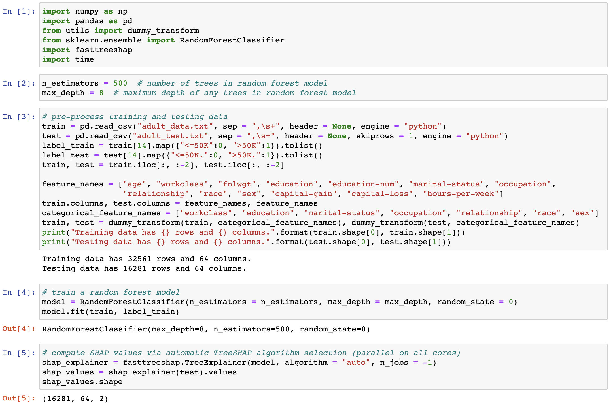
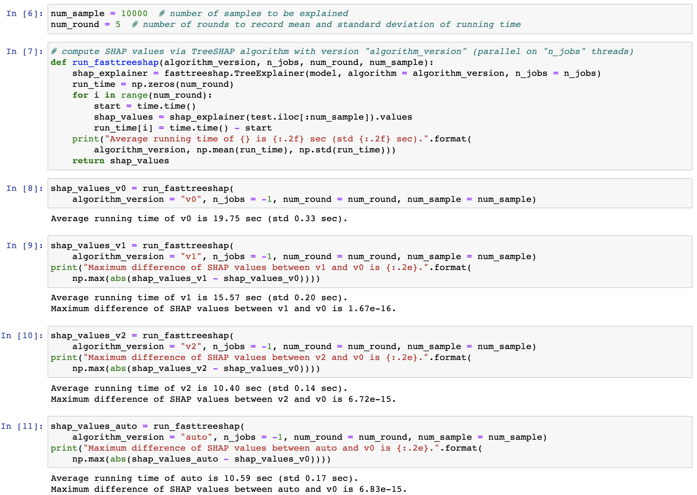

# FastTreeSHAP

FastTreeSHAP package is built based on the paper [Fast TreeSHAP: Accelerating SHAP Value Computation for Trees](https://arxiv.org/abs/2109.09847). It is a fast implementation of the [TreeSHAP](https://arxiv.org/abs/1802.03888) algorithm in the [SHAP](https://github.com/slundberg/shap) package.

## Introduction

[SHAP](https://arxiv.org/abs/1705.07874) (SHapley Additive exPlanation) values are one of the leading tools for interpreting machine learning models. Even though computing SHAP values takes exponential time in general, TreeSHAP takes polynomial time on tree-based models. While the speedup is significant, TreeSHAP can still dominate the computation time of industry-level machine learning solutions on datasets with millions or more entries.

In FastTreeSHAP package we implement two new algorithms, FastTreeSHAP v1 and FastTreeSHAP v2, designed to improve the computational efficiency of TreeSHAP for large datasets. We empirically find that Fast TreeSHAP v1 is **1.5x** faster than TreeSHAP while keeping the memory cost unchanged. Similarly, Fast TreeSHAP v2 is **2.5x** faster than TreeSHAP, at the cost of a slightly higher memory usage.

The table below summarizes the time and space complexities of each variant of TreeSHAP algorithm ( is the number of samples to be explained,  is the number of features,  is the number of trees,  is the maximum number of leaves in any tree, and  is the maximum depth of any tree). Note that the (theoretical) average running time of FastTreeSHAP v1 is reduced to 25% of TreeSHAP.
|TreeSHAP Version|Time Complexity|Space Complexity|
|----------------|--------------:|---------------:|
|TreeSHAP|||
|FastTreeSHAP v1|||
|FastTreeSHAP v2 (general case)|||
|FastTreeSHAP v2 (balanced trees)|||

## Installation

You can clone the repository and install using pip:

```sh
git clone https://github.com/linkedin/fasttreeshap.git
cd fasttreeshap
pip install .
```

## Usage

The following screenshot shows a typical usage of FastTreeSHAP on [Census Income Data](https://archive.ics.uci.edu/ml/datasets/census+income). Note that the usage of FastTreeSHAP is exactly the same as the usage of [SHAP](https://github.com/slundberg/shap), except an additional argument `algorithm` in the class `TreeExplainer`, which indicates the specific TreeSHAP algorithm to use. More specifically, `algorithm` can take values `"v0"`, `"v1"`, `"v2"` or `"auto"` (default):
* `"v0"`: Original TreeSHAP algorithm in [SHAP](https://github.com/slundberg/shap) package.
* `"v1"`: FastTreeSHAP v1 algorithm proposed in [FastTreeSHAP](https://arxiv.org/abs/2109.09847) paper.
* `"v2"`: FastTreeSHAP v2 algorithm proposed in [FastTreeSHAP](https://arxiv.org/abs/2109.09847) paper.
* `"auto"` (default): Automatic selection between `"v0"`, `"v1"` and `"v2"` according to the number of samples to be explained and the memory constraint. Specifically, `"v1"` is always perferred to `"v0"` in any use cases, and `"v2"` is perferred to `"v1"` when the number of samples to be explained is sufficiently large (2^{D+1}/D"/>), and the memory constraint is also satisfied (). More detailed discussion of the above criteria can be found in [FastTreeSHAP](https://arxiv.org/abs/2109.09847) paper.



The code was run on a single core in a Macbook Pro (3.5 GHz Dual-Core Intel Core i7 and 16GB Memory). In the following screenshot, we see that both `"v1"` and `"v2"` produce exactly the same SHAP value result as `"v0"`. Meanwhile, `"v1"` is \~1.5x faster than `"v0"`, and `"v2"` is \~2.5x faster than `"v0"`. `"auto"` selects `"v2"` as the most appropriate algorithm in this use case since the criteria of `"v2"` outperforming `"v1"` discussed above is satisfied.



## Notes

* [SHAP](https://github.com/slundberg/shap) package uses "shortcut" to compute SHAP values for [XGBoost](https://github.com/dmlc/xgboost), [LightGBM](https://github.com/microsoft/LightGBM), and [CatBoost](https://github.com/catboost/catboost) models. Specifically, [SHAP](https://github.com/slundberg/shap) package uses the C++ version of TreeSHAP algorithm embedded in [XGBoost](https://github.com/dmlc/xgboost), [LightGBM](https://github.com/microsoft/LightGBM), and [CatBoost](https://github.com/catboost/catboost) packages directly when computing SHAP values. In FastTreeSHAP, we introduce an additional argument `shortcut` in the class `TreeExplainer`. When `shortcut = True` (default), "shortcut" is used to compute SHAP values for [XGBoost](https://github.com/dmlc/xgboost), [LightGBM](https://github.com/microsoft/LightGBM), and [CatBoost](https://github.com/catboost/catboost) models. When `shortcut = False`, we bypass the "shortcut" and use the code in this package directly to compute SHAP values for [XGBoost](https://github.com/dmlc/xgboost), [LightGBM](https://github.com/microsoft/LightGBM), and [CatBoost](https://github.com/catboost/catboost) models. Note that parallel computing is enabled in the "shortcut" but not in this package (we are currently working on it). More details can be found in the notebook [Census Income](notebooks/fasttreeshap_examples/FastTreeSHAP_Census_Income.ipynb).
* In [FastTreeSHAP](https://arxiv.org/abs/2109.09847) paper, two scenarios in model interpretation use cases are considered: one-time usage (explaining all the samples for once), and multi-time usage (having a stable model in the backend and receiving new data to be scored on a regular basis). The current version of FastTreeSHAP package only supports one-time usage scenario, and we are working on extending it to multi-time usage scenario.

## Notebooks

The notebooks below contains more detailed comparisons between FastTreeSHAP v1, FastTreeSHAP v2 and the original TreeSHAP:
* [Census Income](notebooks/fasttreeshap_examples/FastTreeSHAP_Census_Income.ipynb)
* [Superconductor](notebooks/fasttreeshap_examples/FastTreeSHAP_Superconductor.ipynb)

## Citation
Please cite [FastTreeSHAP](https://arxiv.org/abs/2109.09847) in your publications if it helps your research:
```
@article{yang2021fast,
  title={Fast TreeSHAP: Accelerating SHAP Value Computation for Trees},
  author={Yang, Jilei},
  journal={arXiv preprint arXiv:2109.09847},
  year={2021}
}
```

## License
Copyright (c) LinkedIn Corporation. All rights reserved. Licensed under the [BSD 2-Clause](https://opensource.org/licenses/BSD-2-Clause) License.